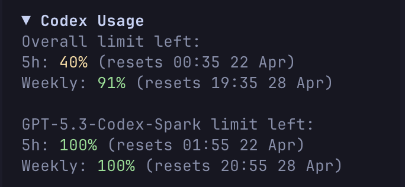
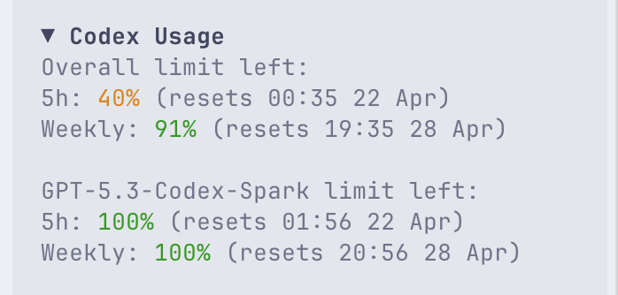

# opencode-plugin-codex-usage

OpenCode TUI plugin that shows live Codex usage limits in the right sidebar.

It reads Codex quota data from `codex app-server` using the same `account/rateLimits/read` RPC that Codex uses for rich clients, then renders the returned buckets inside OpenCode's `sidebar_content` slot.

<p>
  
  
</p>

## What it shows

- The main Codex usage bucket.
- Extra model-specific buckets when Codex exposes them, for example `GPT-5.3-Codex-Spark`.
- The current remaining percentage and reset time for each available window.

## Installation

Install it like any other OpenCode plugin:

```bash
opencode plugin opencode-plugin-codex-usage
```

If you want to configure it in your workspace-local TUI config, add this to `.opencode/tui.json`:

```json
{
  "$schema": "https://opencode.ai/tui.json",
  "plugin": [["opencode-plugin-codex-usage", { "refreshMs": 30000 }]]
}
```

Restart OpenCode after updating the config.

## Manual Installation

For a local checkout, install dependencies in this repository:

```bash
cd opencode-plugin-codex-usage
bun install
```

Then point `.opencode/tui.json` at the local source:

```json
{
  "$schema": "https://opencode.ai/tui.json",
  "plugin": [["file:///absolute/path/to/opencode-plugin-codex-usage", { "refreshMs": 30000 }]]
}
```

Restart OpenCode after updating the config.

## Configuration

The plugin accepts these options in `tui.json`:

```json
{
  "plugin": [["file:///absolute/path/to/opencode-plugin-codex-usage", {
    "refreshMs": 30000,
    "codexBinary": "codex"
  }]]
}
```

Options:

- `refreshMs`
  Poll interval in milliseconds.
  Default: `30000`
  Minimum enforced value: `15000`

- `codexBinary`
  Command or absolute path used to launch Codex.
  Default: `codex`

The current local test configuration in this workspace uses `refreshMs: 30000`.

## Local Verification

Run the import smoke test:

```bash
cd opencode-plugin-codex-usage
bun run check
```

That verifies the plugin module can be imported with OpenTUI runtime support.

## Performance Notes

- CPU: low. The plugin is idle most of the time and does a short refresh on an interval and when a session becomes idle.
- Memory: low. It keeps only a small in-memory snapshot of the latest limit data.
- Token/context usage: none. It does not call the model or inject extra prompt/context into OpenCode sessions.

The only real overhead is that each refresh launches a short-lived `codex app-server` process to read the current rate limits. At the default `30000ms` this should be light, but if you want even less churn you can increase `refreshMs` to `60000` or `120000`.
